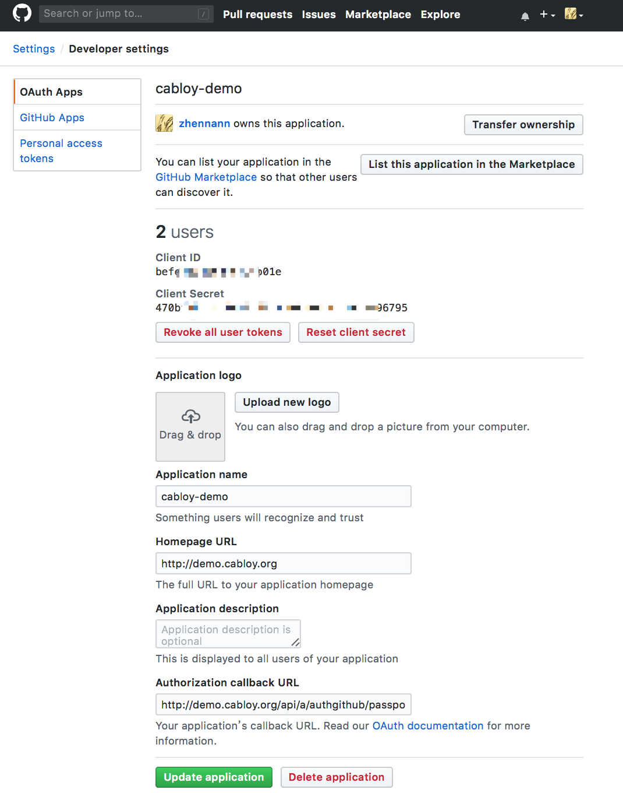

# 认证

Cabloy对[Egg Passport鉴权](https://eggjs.org/zh-cn/tutorials/passport.html)作了进一步封装，使`认证`开发更简洁，`认证`使用维护更简便，实现`开箱即用`的效果

Cabloy使用数据表`aAuth`统一管理`用户认证`信息，使用数据表`aAuthProvider`统一管理`认证提供者`。简单的`用户密码认证`，以及其他的第三方认证，都通过`认证提供者`实现

## 后端配置

以`Github`为例，其他第三方认证配置与此类似

### 1. 取得OAuth信息

进入`Github`官网，新建一个`OAuth App`，取得OAuth信息：`Client ID`、`Client Secret`



!> Authorization callback URL: https://demo.cabloy.org/api/a/authgithub/passport/a-authgithub/authgithub/callback

### 2. 设置OAuth信息

以管理员身份登录（如用户`root`），进入`认证管理/认证-Github`页面，输入`Client ID`和`Client Secret`，其他字段保持默认值

### 3. 重启后端服务

## 前端配置

Cabloy通过模块`a-login`提供了缺省的login页面，通过前端配置可以实现各种`认证提供者`的组合

!> 也可以提供自己的login页面，请参考模块`a-layoutmobile`

`a-login/front/src/config/config.js`

```javascript
export default {
  provider: {
    simple: {
      module: 'a-authsimple',
      component: 'signin',
    },
    buttons: {
      github: {
        module: 'a-authgithub',
        component: 'button',
      },
    },
  },
};
```

> - provider: 提供者清单
>   - simple: 简单登录的提供者信息
>   - buttons: 第三方认证提供者信息
>     - github: Github提供者信息
>       - module: 所属模块
>       - component: 前端显示组件

