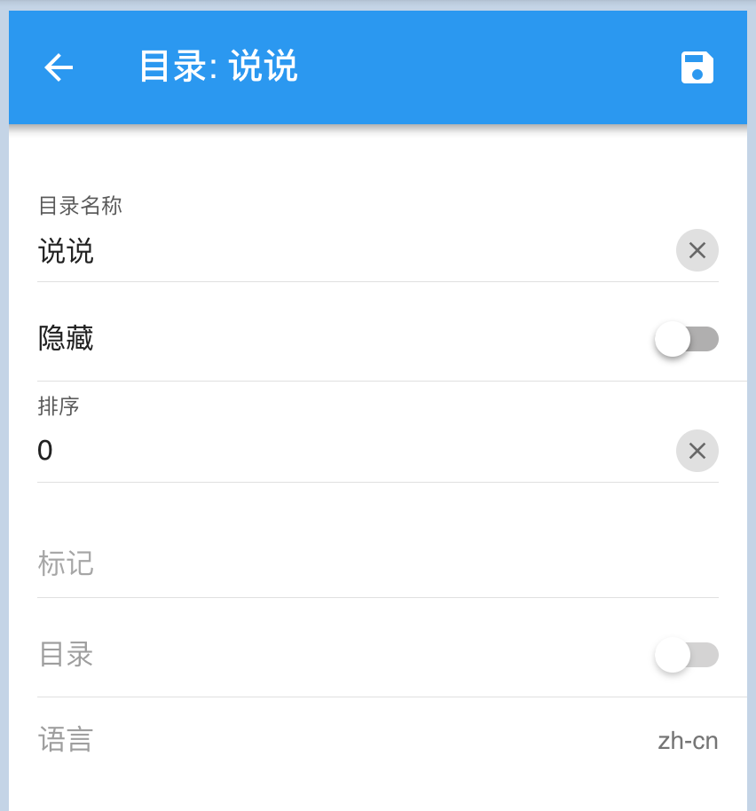

# 再谈文章：高级属性

`文章`除了前面谈到的`基本属性`，也可以设置`高级属性`，从而实现更灵活的定制

## 高级属性

|名称|中文|类型|说明|
|-|-|-|-|
|atomName|标题|String||
|content|内容|String||
|language|语言|String|文章归属的语言|
|categoryId|目录Id|Number|文章归属的目录|
|tags|标签|JSON|文章的标签清单|
|keywords|关键字|String|SEO相关|
|description|描述|String|SEO相关|
|slug||String||
|allowComment|允许评论|Boolean|是否开启文章评论|
|sticky|置顶|Boolean|文章置顶|
|sorting|排序|Number|文章排序|
|flag|标记|String|自定义字段，可根据需要存储合适的值|
|extra|额外属性|JSON|自定义字段，可根据需要存储合适的值|

> slug: 如果不设置`slug`，就采用uuid生成文章链接

> sorting: 在`博客类型`站点中，文章一般按时间排序。但是在`文档类型`站点中，文章可以按`sorting`排序

