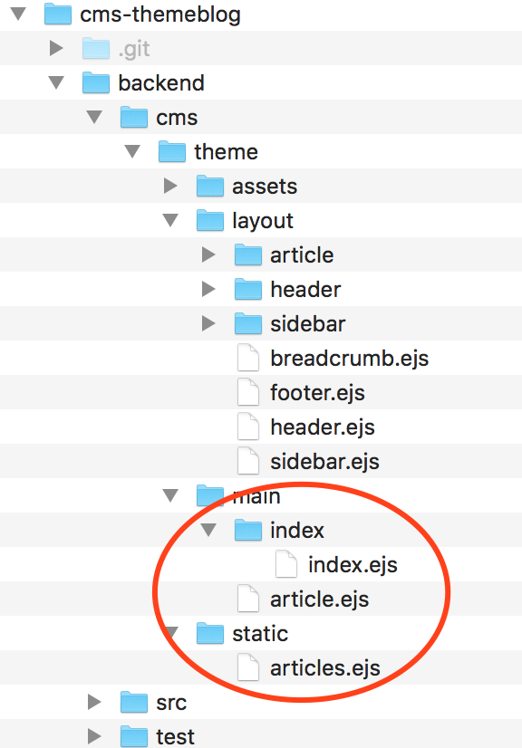

# 举例：主题：cms-themeblog

模块`cms-themeblog`是官方提供的博客主题

## 插件依赖

因为`主题`和`插件`都是独立的EggBorn模块，会持续的进行版本迭代

为了在版本迭代过程中保持代码一致性，从而避免版本冲突，`主题`需要显式声明依赖了哪些`插件`模块

通过声明`插件`模块的依赖关系，当安装`主题`模块时，相应的`插件`模块也会自动安装

比如，主题`cms-themeblog`目前依赖两个插件模块：`cms-pluginbase`, `cms-plugintrack`

`cms-themeblog/package.json`

``` javascript
{
  "name": "egg-born-module-cms-themeblog",
  "version": "1.1.3",
  "title": "cms:theme:blog",
  "eggBornModule": {
    "cms": {
      "name": "blog",
      "theme": true
    },
    "dependencies": {
      "a-instance": "1.0.0"
    }
  },
  ...
  "dependencies": {
    ...
    "egg-born-module-cms-pluginbase": "^1.0.9",
    "egg-born-module-cms-plugintrack": "^1.0.1"
  }
}
```

## 安装主题

``` javascript
$ npm i egg-born-module-cms-themeblog
```

## 渲染模版



|名称|说明|渲染时机|备注|
|-|-|-|-|
|assets|资源文件|一次构建||
|layout|布局目录|中间文件|`layout`不是官方强制定义的目录。主题可根据自己的需要添加，规划自己的页面元素|
|main|主渲染模版目录|两个渲染时机||
|main/article.ejs|文章渲染模版||当需要渲染`文章`时使用此模版文件|
|main/index|首页渲染模版目录||当需要渲染`首页`时使用此目录中的模版文件。为什么是目录？在一个复杂的站点中，根据场景需要可以有多个类`首页`模版文件|
|static|静态文件目录|一次构建|如文件`articles.ejs`，通过ajax调用后端API获取文章清单，从而可以集中实现`目录`、`标签`、`搜索`等功能|

- 主题`cms-themeblog`提供了三个主渲染模版：`static/articles.ejs`, `main/article.ejs`, `main/index/index.ejs`
- `assets`是资源目录
- `layout`是布局目录，包含布局元素的渲染模版

> 其实，`layout`中大多数渲染模版文件内容很精简，为何不合并成一个渲染文件，而要拆分这么细致？
> - 布局元素拆分细致，是为了在`主题`的实际使用当中，自定义环节可以做更少的变更，也便于更快的升级到`主题`的更新版本

## 主渲染模版

### static/articles.ejs

``` html
<%- await include('../layout/header.ejs') %>
<div class="row">
  <div class="col-sm-8">
    <section>
      <%- await include('../layout/breadcrumb.ejs') %>
      <ul class="article-list media-list">
      </ul>
    </section>
  </div>
  <div class="col-sm-4">
    <%- await include('../layout/sidebar.ejs') %>
  </div>
</div>
<%- await include('../layout/footer.ejs') %>
```

### main/article.ejs

``` html
<%- await include('../layout/header.ejs') %>
<div class="row">
  <div class="col-sm-8">
    <article>
      <%- await include('../layout/breadcrumb.ejs') %>
      <%- await include('../layout/article/title.ejs')%>
      <%- article.html %>
      <%- await include('../layout/article/attachments.ejs') %>
      <%- await include('../layout/article/stat.ejs') %>
      <%- await include('../layout/article/brothers.ejs') %>
      <%- await include('../layout/article/comments.ejs') %>
    </article>
  </div>
  <div class="col-sm-4">
    <%- await include('../layout/sidebar.ejs') %>
  </div>
</div>
<%- await include('../layout/footer.ejs') %>
```

### main/index/index.ejs

``` html
<%- await include('../../layout/header.ejs') %>
<div class="row">
  <div class="col-sm-8">
    <section>
      <%- await include('../../layout/breadcrumb.ejs') %>
      <ul class="article-list media-list">
        <%
          // options
          const options = {
            where: {
              'f.language': site.language.current,
            },
            orders: [
              [ 'f.sticky', 'desc' ],
              [ 'a.createdAt', 'desc' ],
            ],
            page: { index:0 },
            mode: 'list',
          };
          // select
          const data=await ctx.performAction({
            method:'get',
            url: '/a/cms/article/list',
            query: { options:JSON.stringify(options) },
          });
          // index
          env('index',{
            [_path]:data.index,
          });
          // list
          for(const item of data.list){
             const sticky = !item.sticky ? '' : '<span class="glyphicon glyphicon-pushpin"></span> ';
             const attachment = item.attachmentCount===0 ? '' : '<span class="glyphicon glyphicon-paperclip"></span> ';
             const media = !item.imageFirst ? '' : `
<div class="media-right">
      <a target="_blank" href="${url(item.url)}">
        
      </a>
</div>
        `;
        // tags
        let tagsText='';
        const tags=item.tags?JSON.parse(item.tags):null;
        if(tags && tags.length>0){
          tagsText+='<span class="num glyphicon glyphicon-tags"></span> ';
          for(const tag of tags){
            tagsText+=`<a target="_blank" href="${url('static/articles.html')}?tagId=${tag.id}&tagName=${tag.name}"><span class="num tag">${tag.name}</span></a>`;
          }
          tagsText+='';
        }
        // stat
        const stat=`
<div class="title stat" data-article-id="${item.atomId}">
<a target="_blank" href="${url('static/articles.html')}?categoryId=${item.categoryId}&categoryName=${item.categoryName}"><span class="num category">${item.categoryName}</span></a>
<span class="num date">${util.formatDateTime(item.createdAt)}</span>
<span class="glyphicon glyphicon-eye-open"></span><span class="num readCount"></span>
<span class="glyphicon glyphicon-heart"></span><span class="num starCount"></span>
<a target="_blank" href="${url(item.url)}#comments"><span class="glyphicon glyphicon-comment"></span><span class="num commentCount"></span></a>
${tagsText}
</div>
        `;

        const html= `
<li class="media">
    <div class="media-body">
      <h4 class="media-heading">${sticky}${attachment}<a target="_blank" href="${url(item.url)}">${item.atomName}</a></h4>
      ${item.description || item.summary}
      ${stat}
    </div>
    ${media}
</li>
        `;
          echo(html);
          }
        %>
      </ul>
    </section>
  </div>
  <div class="col-sm-4">
    <%- await include('../../layout/sidebar.ejs') %>
  </div>
</div>
<%- await include('../../layout/footer.ejs') %>
```

### static/articles.ejs与main/index/index.ejs的区别

两个渲染模版的布局一致，为什么要分开实现？

为了兼顾`SEO优化`、`首页加载性能`、`文章单独渲染`性能，对不同场景的页面做了不同的渲染设计

- `首页`预先渲染第一页文章列表（默认为20篇），当向下滚动时，加载后续的文章列表
- `目录`、`标签`、`搜索`场景下，不需要预先渲染第一页文章列表
- 因此，`main/index/index.ejs`需要支持`两个渲染时机`，而`static/articles.ejs`只需要`一次构建`

## 布局渲染模版

这里着重介绍`header`和`footer`的渲染模版，其他内容请直接查看模块源码

### layout/header.ejs

``` html
<!DOCTYPE html>
<html>
<head>
  <%- await include('./header/head.ejs') %>
</head>
<body>
  <header>
    <div class="container">
      <%- await include('./header/title.ejs') %>
      <%- await include('./header/menu.ejs') %>
    </div>
  </header>
  <div class="container container-site">
```

### layout/header/head.ejs

``` html
<meta charset="utf-8">
<meta http-equiv="X-UA-Compatible" content="IE=edge">
<meta name="viewport" content="width=device-width, initial-scale=1, user-scalable=no">
<link rel="shortcut icon" href="<%=url('assets/images/favicon.ico')%>" type="image/x-icon">
<%- await include('../../plugins/cms-pluginbase/header/meta.ejs') %>
<%- await include('../../plugins/cms-pluginbase/header/css.ejs') %>
<%- await include('../../plugins/cms-pluginbase/header/js.ejs') %>
<%
  // pluginbase init
  js('../../plugins/cms-pluginbase/assets/js/init.js.ejs');
%>
<%
  // css
  css('../../assets/css/site.css.ejs');
  // js
  js('../../assets/js/site.js.ejs');
%>
```

- 通过`include`包含插件`cms-pluginbase`的模版文件
- 通过`js`声明使用的JS文件
- 通过`css`声明使用的CSS文件

### layout/footer.ejs

``` html
  </div> <!-- container -->
  <footer>
      <span class="small">Powered by <a target="_blank" href="https://cms.cabloy.org">Cabloy-CMS</a> | Theme - <a target="_blank" href="https://github.com/zhennann/egg-born-module-cms-themeblog">cms-themeblog</a></span>
    </footer>
  <%- await include('../plugins/cms-pluginbase/footer.ejs') %>
  <%- await include('../plugins/cms-plugintrack/track.ejs') %>
</body>
</html>
```

- 通过`include`包含插件`cms-pluginbase`和`cms-plugintrack`的模版文件


