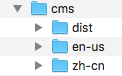
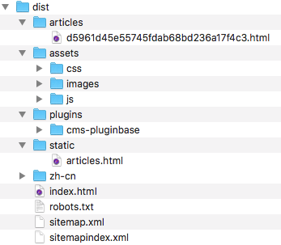
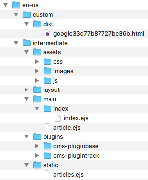

# 文件结构

Cabloy-CMS采用精细的文件结构，带来了如下便利：
  - 便于定制CSS、JS
  - 便于定制图片等各类静态资源
  - 便于实现多语言
  - 便于调试与发布

> 建议先把服务运行起来，并`构建`一次，就可以清晰的看到Cabloy-CMS的文件结构

## 根目录

在开发环境中，为了便于调试，CMS文件`根目录`位于源代码项目内部。而在生产环境中，源代码项目可能是只读的，所以CMS文件`根目录`缺省放置在当前用户的Home目录中。

### 开发环境

根目录：`[ProjectDir]/src/backend/app/public/[InstanceId]/cms`

- InstanceId: 实例Id，通过多实例可以实现多CMS站点的搭建

### 运行环境

根目录：`[HomeDir]/cabloy/[ProjectName]/public/[InstanceId]/cms`

- HomeDir: 默认为当前用户的Home目录，可以通过模块`a-file`配置

`src/backend/config/config.prod.js`

``` javascript
config.modules = {
  'a-file': {
    publicDir: 'CustomDir',
  },
};
```

## 一级目录



|名称|说明|
|-|-|
|dist|`构建`的输出目录|
|en-us/zh-cn|语言源码目录|

## 输出目录



|名称|说明|渲染时机|备注|
|-|-|-|-|
|articles|存储所有渲染的文章页面|一次构建||
|assets|资源文件|一次构建||
|plugins|插件的资源文件|一次构建||
|static|静态文件|一次构建|如文件`articles.html`，通过ajax调用后端API获取文章清单，从而可以集中实现`目录`、`标签`、`搜索`等功能|
|zh-cn|其他语言的文件输出目录||支持多语言时，缺省语言在`根目录`下，其他语言在`子目录`下|
|index.html|首页|两个渲染时机|为了提升首页加载性能，首页可能会包含最近发布的文章。所以，当`文章`单独渲染时，也会再次渲染`首页`|
|robots.txt|SEO相关|一次构建|不论是否有多语言，只有一个`robots.txt`在`根目录`下|
|sitemap.xml|SEO相关，当前语言的站点地图文件|一次构建，`文章`单独渲染时修改内容||
|sitemapindex.xml|SEO相关，站点地图文件索引|一次构建|不论是否有多语言，只有一个`sitemapindex.xml`在`根目录`下|

## 语言源码目录



|名称|说明|备注|
|-|-|-|
|intermediate|中间文件目录|在一次`构建`时，将`主题`、`插件`、`自定义源码`的所有源码文件和资源统一写入`intermediate`目录，然后再执行渲染逻辑|
|custom|自定义源码目录|用户可以在`custom`目录添加自定义源码文件，在一次性`构建`时，会自动覆盖`intermediate`中相同路径的文件|
|custom/dist|特别输出目录|在实际生产环境中，会有一些第三方用途的文件，如`Google站点验证文件`，可以放置在这个目录，以便一次`构建`时输出|

|名称|说明|渲染时机|备注|
|-|-|-|-|
|assets|资源文件|一次构建||
|layout|布局目录|中间文件|`layout`不是官方强制定义的目录。主题可根据自己的需要添加，规划自己的页面元素|
|main|主渲染模版目录|两个渲染时机||
|main/article.ejs|文章渲染模版||当需要渲染`文章`时使用此模版文件|
|main/index|首页渲染模版目录||当需要渲染`首页`时使用此目录中的模版文件。为什么是目录？在一个复杂的站点中，根据场景需要可以有多个类`首页`模版文件|
|plugins|插件目录|一次构建|在一次`构建`时，把所有`插件`源码文件和资源写入`plugins`目录|
|static|静态文件目录|一次构建|如文件`articles.ejs`，通过ajax调用后端API获取文章清单，从而可以集中实现`目录`、`标签`、`搜索`等功能|

> 为什么需要把所有源码文件（`主题`、`插件`、`自定义源码`）都写入`intermediate`目录？
> - 写入一个目录，便于各文件之间的包含引用
