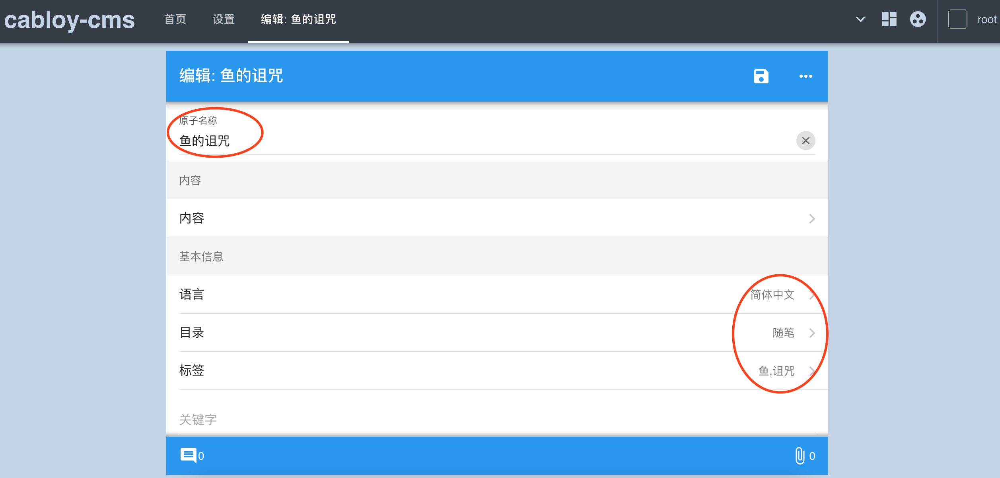
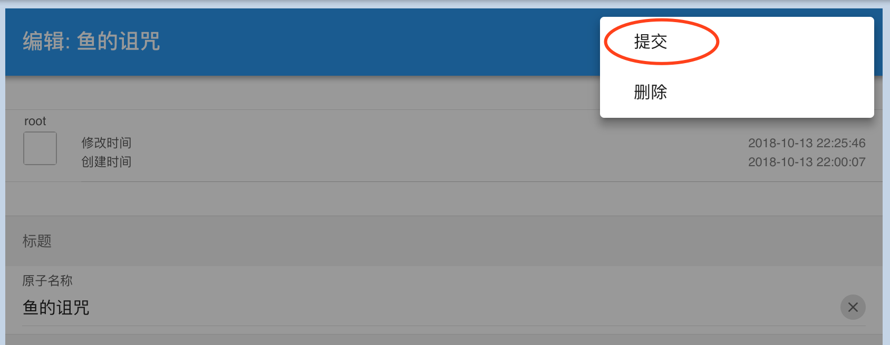
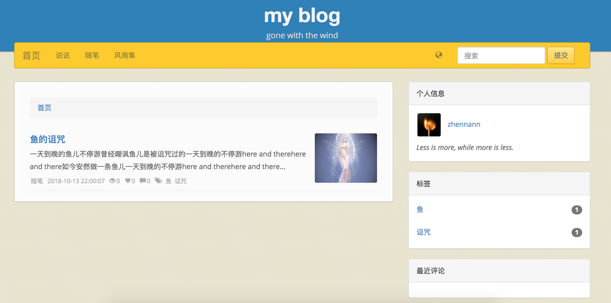
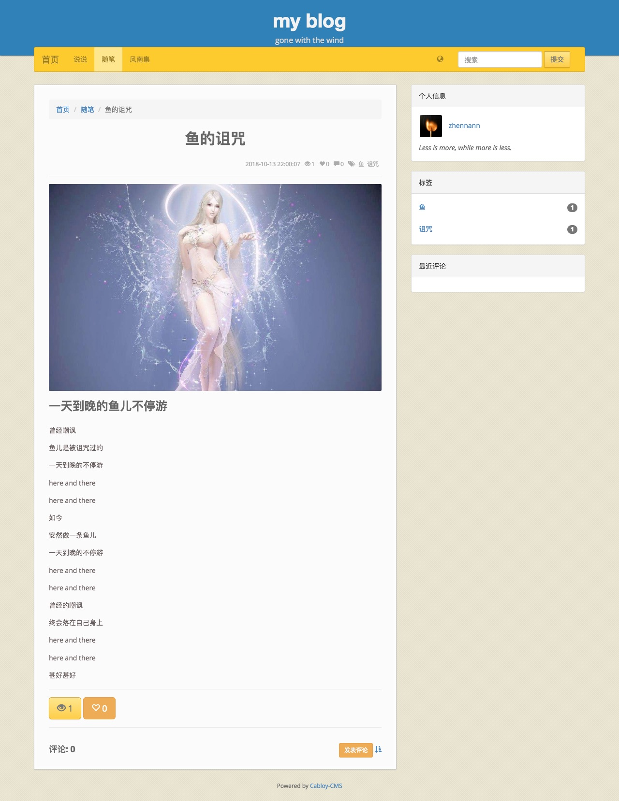

# 文章

  Cabloy-CMS后台提供了完备的文章管理功能。当文章提交发表时，实时渲染成静态文件，并写入Sitemap文件

## 如何操作

### 基本属性

在后台首页，点击`新建文章`，进入文章编辑页面，依次输入或选择如下属性值：

- 原子名称：也就是文章标题。`原子`是Cabloy对基础业务数据的通用定义
- 语言：
- 目录：
- 标签：支持多标签，用逗号隔开



### 内容

Cabloy-CMS采用开源组件[mavonEditor](https://github.com/hinesboy/mavonEditor)，实现了`markdown`格式的编辑和预览效果

请输入以下内容，并查看效果

```


## 一天到晚的鱼儿不停游

曾经嘲讽

鱼儿是被诅咒过的

一天到晚的不停游

here and there

here and there


如今

安然做一条鱼儿

一天到晚的不停游

here and there

here and there


曾经的嘲讽

终会落在自己身上

here and there

here and there


甚好甚好


```

### 提交发布

Cabloy中所有的原子数据均有两个状态：`草稿`、`正常`。`草稿`状态下只有创建人能访问和编辑，通过`提交`转入`正常`状态，其他用户才能访问。

`文章`也不例外，只有`提交`进入`正常`状态，才会进行渲染。

当然，如果`文章`已是`正常`状态，那么再次编辑并保存时，也会进行渲染。

### 提交并预览



首页



文章页



