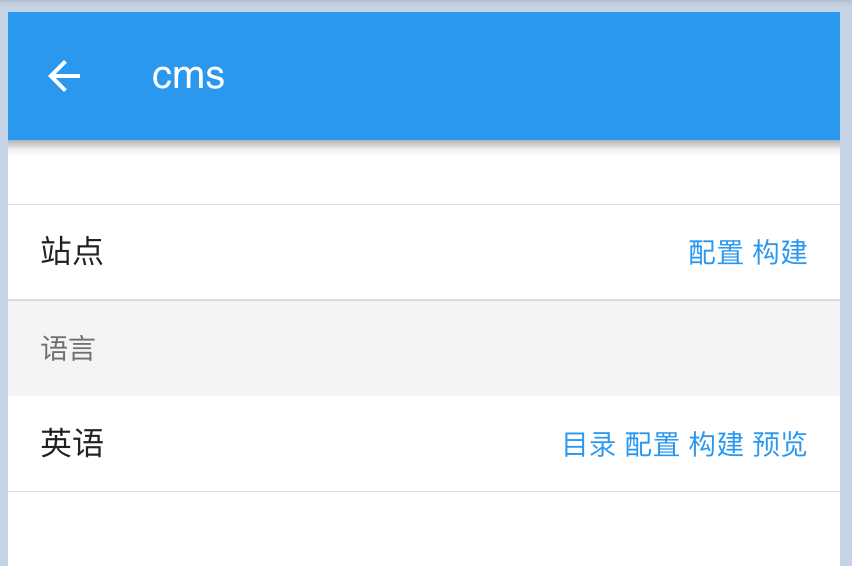
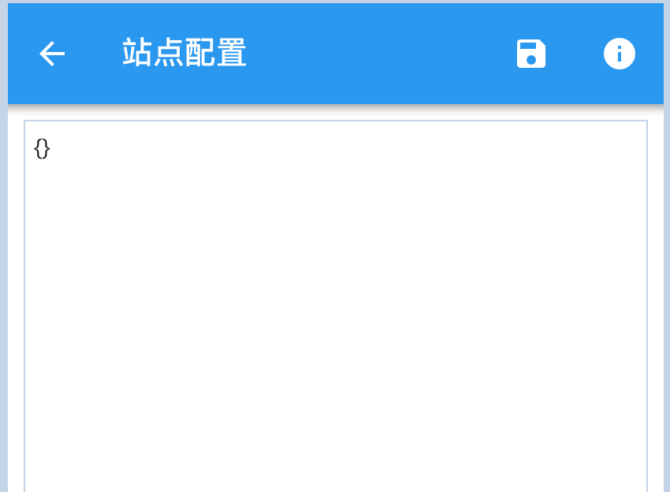
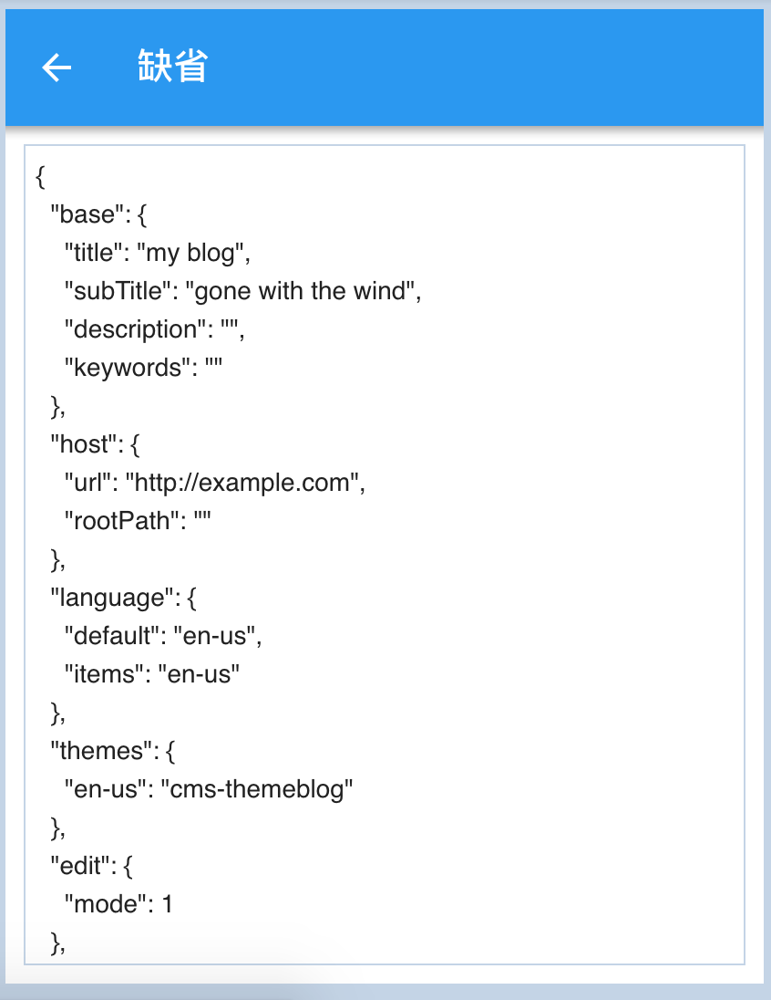

# 参数配置

## 参数覆盖规则

`语言配置` > `站点配置` > `缺省配置`

- 语言配置：由于支持多语言，因此不同的语言可以配置不同的参数
- 站点配置：配置与语言无关的全局参数
- 缺省配置：会因使用不同的主题而拥有不同的参数

## 站点配置

进入`设置/cms`页面



点击`站点/配置`，进入`站点配置`页面



点击右侧的，查看`缺省配置`



从`缺省配置`拷贝需要修改的属性到`站点配置`页面，并修改成所需要的值。

在这里，我们修改如下参数:

``` json
{
 "host": {
    "url": "http://example.com",
    "rootPath": ""
  },
  "language": {
    "default": "zh-cn",
    "items": "zh-cn,en-us"
  },
  "themes": {
    "zh-cn": "cms-themeblog",
    "en-us": "cms-themeblog"
  },
  "plugins": {
    "cms-plugintrack": {
      "track": {
        "google": "",
        "baidu": "",
        "qq": ""
      }
    }
  }
}
```

- host
  - url: 实际部署时的站点域名
  - rootPath: 根路径，一般设置
- languange
  - default: 缺省语言。
  缺省语言渲染的静态文件位于站点“根目录”，其他语言位于站点“根目录/[语言]”
  - items: 支持的语言列表，用逗号分隔
- themes
  - zh-cn: 语言所使用的主题
  - en-us: 语言所使用的主题
- plugins
  - cms-plugintrack
    - track
      - google: google统计的跟踪代码
      - baidu: 百度统计的跟踪代码
      - qq: 腾讯统计的跟踪代码

## 语言配置

可以依次对不同的语言配置参数，这里从略


